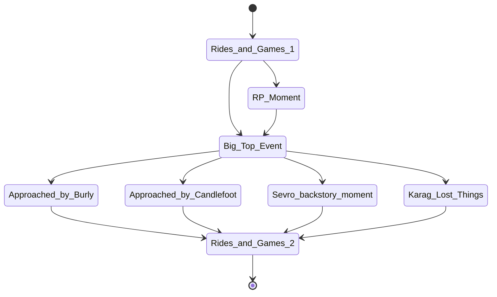

[COMPLETE]

# Recap
- Intro Recap
    - The Witchlight Carnival is a fairground of kaleidoscopic tents and wagons crewed by wondrous beings. Having arrived recently in the area you have all found yourselfs entering the fairgrounds for each of your own reasons. 
        - Di and Sevro you've arrived to search for an entrace to the Feywild at the request of their old friend Madryck. Madryck asked you to find his patron, Zalbina and ensure she is alive and safe as his connection to her has recently terminated, worrying him deeply.
        - Karag and Mellow you've each found yourself here under auspicious circumstances. In each of your pasts you stole a visit to the Witchlight carnival and while there you had something stolen from you in turn. Your feet have found there way here as if compelled to discover what was stolen and by whom.
        - Yanaba you've always been a bit... out of place. Your parents, family and village loved you deeply and would stick up for you through thick and thin.. but it was never lost on you that they were humans and you, most certainly were not. After a strange dream in which you traveled to a brilliant and strange world and met a gentle soul asking for help you decided to put that quant life behind you and forge your own destiny. Not knowing where to start, you let the wind carry you forward which has brought you to a strange and dazzling carnival.
        - Nuff you've known only the carnival ever since you were a little faerie. You grew up surrounded by the bright colors and cheery individuals. Your youngest memory is of you and Burly chasing a nude streaker out of the carnival. You've trained and become strong by wrestling the goblin triplets. These are your friends and family and in a way Mr. Witch and Mr. Light are your dads. You go where you go and you go with a vibin soul, and this is how you've found yourself in the company of a strange group of carnival attendees.

- Session recap
    - What do the players remember from the last session

    - Di and Sevro went and checked out the illusionary hall of mirrors and saw the Kenku
    - The group lead by Di found their way into the employee area
    - Weston: Di learned how to forment cheese in his folds
    - Cas: Karag and Mellow arrived, got into a staring contest with a cylops, and fought Nuff about his wings

# Story beats
1. [ENCOUNTER] [DONE] Let the party select where they want to go within Witchlight (Games, Rides and Attractions 4) [1 hour]

2. RP Moment (Have the players roll for it)

3. [TIMED_EVENT] Bigtop Event [1 hour]

4. [STORY_BEAT] Approached by Candlefoot who will "ask" the party to follow him to the Hall of Illusions where he will try and tell them he say the Kenku disappear into one of the back mirrors.

5. [BACKSTORY] [DONE] Sevro will run into "William Montego Juriahson"
    - Elf-helf, slicked back brown hair, 2 golden ear rings in one ear, a large sharp smile, wearing decadent clothing.

    - "Well now, what's a run-away loser like you doing in a cheery place like this?"
    - "You'll be happy to know that the town is better off with out you or your families reek"
    - "Though you don't deserve the explaination, I do have to excuse myself Sadro. I'm meeting a few ladies shortly and wouldn't want to keep them waiting on account of... you."

    - The half-elf will pull a lute off his back as he walks away and will sing
        - "I met a sad man, upon my travels, with a sad look, lost and unraveled"

6. [HAPPENING] [SKIPPED/RESOLVED] Karag see's the same Lornling that had stolen from him when he was young
    - When Karag is reminded about his wings again ensure this plays out
    - If Karag chases the Lornling have him roll perception checks to keep up with the creature. If he makes 3 in a row with increasing difficulty (5, 10, 15) then he sees the creature disappear into the Hall of Illusions

7. [ENCOUNTER] Let the party select where they want to go within Witchlight (Games, Rides and Attractions 4) [1 hour]

8. [STORY_BEAT] Approached by Burly

# Session notes
1. Kettlesteam will be responsible for messing with the animal cages and collars. She did this to cause a distraction. During the BigTop event, the Kenku will sneak into the Hall of Illusions and will disappear into Prismeer.
    - Candlefoot will have seen the Kenku enter and after following her in, will see her disappear into Prismeer and worried, will seek out the party to help find the creature. (Though he isn't actually aware that Kettlesteam has his voice)

2. If approached, Ellywick will tell Yanaba that a few friends of hers are in need of help and after a dream she came to the Witchlight in hopes to find her. One of her friends is Elidon who she suspects has been captured by whomever took over her Patron's Fey realm of Prismeer. Unfortunately Ellywick is not able to travel to Prismeer herself, she has tried but when she tries to cross something rebukes her entrance. She suspects this was something done by whomever stole Prismeer from her Patron.

3. Burly will be looking to speak to Nuff after the BigTop event. He is worried about his brother and suspects that Mr. Witch and Mr. Light know where he and many others have disappeared to. He will explain that he suspects that the scary creatures that steal things from folks are to blame and will ask Nuff to find his brother for him. Mr. Witch and Mr. Light aren't likely to give up information freely for whatever reason, so it is likely that Nuff and his new friends will need to steal something valuable from them to force their hand.

# Session flowchat

# Session Notes
- Hours passed: 4

- Nuff and Burly jump Karag to get his wings on
    - Karag
    - Burly puts honey on the back of the wings at Nuff's behest
    - Nuff does manage to get the wings

- Yanaba doesn't eat meat

- Thunderdome
    - Sevro, Yanaba, Nuff and Karag put on suits
    - They beat it
    - Sevro is knocked unconscious
        - Nuff attempts to save Sevro from the electic beams and very narrowly does save him by killing the clown.
    - Sevro saves Yanaba from being hit by electricity

- Sevro's RP moment
    - Nuff, Karag and Yanaba all stand up for Sevro as this is happening
    - Yanaba tripped Sevro's ill itentioned invidual

- Picking something to do at the Witchlight
    - Snail racing
        - Betting
            - Sevro - Purple - 9g
            - Di - Purple - 6g
            - Karag - Orange - 10g
        - Sevro went after the snails and got his butt kicked by the snails
        - Karag split his earnings with the group
        - Orange won by a split second

    - Pie eating
        - Yanaba and Nuff met Ellywick, Yanaba got some information out of Ellywick about Elidon
            - His wifes name is Lamorna
            - She bought her a ticket as the threads of destiny wind through her and Ellywick believes it is her best chance at ensuring her friends safety
            - Ellywick mentioned Prismeer as a Fey Realm who is ruled over by Zalbina

        - Yanaba and Nuff just barely lose the pie eating contest contest
            - They seem to find common companionship through their small size

- Extra notes
    - Di is walking around with the giant constrictor snake following him which is scaring the crowds and will likely need to be dealt with by the staff
        - They'll ask where he got the staff and if Di is honest perhaps I'll run a scene where Orla is getting chewed out by Mr. Witch for handing out a potentially dangerous prize
